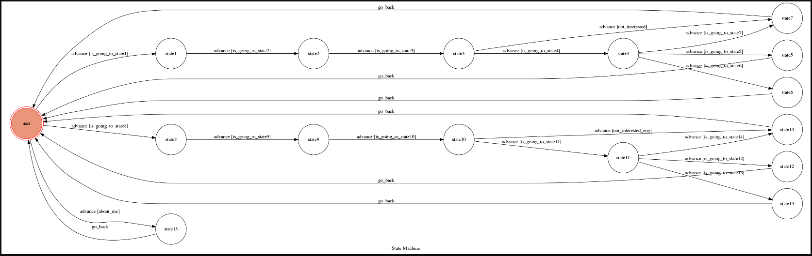

# ChatBot - TravelTaiwan

Code is based on [templete](https://github.com/Lee-W/TOC-Project-2017) made by [Lee-W](https://github.com/Lee-W)

TravelTaiwan is a  telegram bot based on a finite state machine.

It can help you with planning your trips in Taiwan by giving you a list of places to visit, as well as the information of that scenic attraction provided by [Tourism Bureau, Republic of China (Taiwan)](http://eng.taiwan.net.tw/).

**Note that this bot only supports Chinese or English inputs**


## Setup

### Prerequisite
* Python 3

#### Install Dependency
```sh
pip3 install -r requirements.txt
```

* pygraphviz (For visualizing Finite State Machine)
   * [Setup pygraphviz on Ubuntu](http://www.jianshu.com/p/a3da7ecc5303)
* BeautifulSoup (For parsing the data from the Tourism Bureau Website )
  * [Setup BeautifulSoup on Ubuntu](https://www.crummy.com/software/BeautifulSoup/bs4/doc/#installing-beautiful-soup)
 

* pymongo (For storing and retreiving the data parsed from the website)
  * [Setup pymongo on Ubuntu](https://pypi.python.org/pypi/pymongo)
  
### Secret Data

`API_TOKEN` and `WEBHOOK_URL` in app.py **MUST** be set to proper values.
Otherwise, you might not be able to run your code.

### Run Locally
You can either setup https server or using `ngrok` as a proxy.

**`ngrok` would be used in the following instruction**

```sh
ngrok http 5000
```

After that, `ngrok` would generate a https URL.

You should set `WEBHOOK_URL` (in app.py) to `your-https-URL/hook`.

#### Run the sever

```sh
python3 app.py
```

## Finite State Machine


## Usage
The initial state is set to `user`.

You can enter either "中文" or "English" to choose your language from there.

You can also type "關於我" or "About me" to see the information about this bot.

From other states, you can enter the input according to the instructions provided by the bot. If you entered a message that the bot cannot understand, you can re-enter according to its instructions.

The bot will retreive data according to your quests, and will ask the you to re-submit if that data is not found in the database.

After you finished a complete quest service, it will `go_back` to `user` state.


## Author
[Kathy Shiu](https://github.com/katherine0504)
